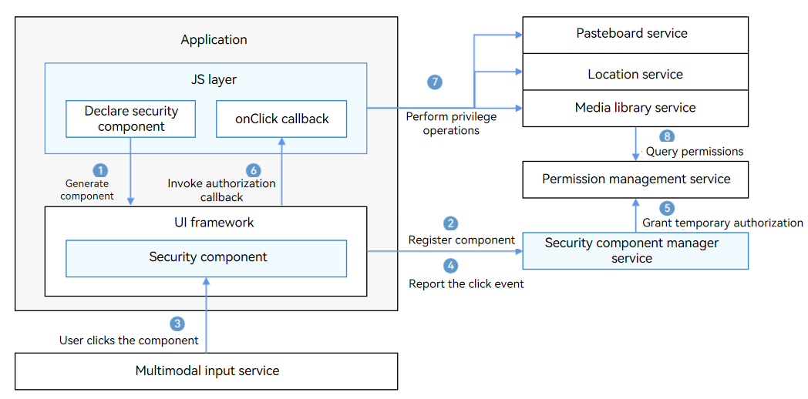

# Security Component Manager Service

## Introduction

The security components are a set of ArkUI components provided by OpenHarmony, like <**Button**> and <**Text**>. You can integrate them to your application UI.
When a security component is clicked, the application is granted temporary permissions and can access the user's private data without applying for permissions. This minimizes the interference of the authorization pop-up windows to users.

For example, if you integrate the **LocationButton** component into your application, you do not need to apply for the location permission. When the user clicks this component, the application can obtain the temporary location permission in the foreground and call the location service API to obtain location information.

The following figure illustrates the working mechanism of security components.



The security components are implemented by UX implementation and security component manager service. Integrated in the ArkUI framework, the UX implementation is responsible for drawing components. The security component manager service manages the security components, performs validity checks, and grants temporary permissions.

The security component manager service provides the following functions:

- Provides native interfaces for registering or unregistering a security component, and granting temporary permissions to the application.

- Checks the validity of security components. Only valid security components can be authorized successfully.

- Provides native interfaces for the mediaLibrary service to query temporary permissions.

- Provides APIs and adaptation layer for vendors to customize security enhancement functions.


## Directory Structure

```
/base/security/security_component_manager
├── frameworks                  # Code of basic functionalities
│   ├── common                  # Common code
│   ├── enhance_adapter         # Adaptation code for capability enhancement
│   └── security_component      # Framework code of the security component service
├── interfaces                  # APIs
│   └── inner_api               # Internal APIs
│       ├── enhance_kits        # APIs for security component configuration
│       └── security_component  # Security component service APIs
└── services                    # Services
    └── security_component_service/sa
        └── sa_main             # System ability code of the security components

```

## Usage
### Available APIs

| **API**| **Description**|
| --- | --- |
| int32_t RegisterSecurityComponent(SecCompType type, const std::string& componentInfo, int32_t& scId); | Registers a security component.|
| int32_t UpdateSecurityComponent(int32_t scId, const std::string& componentInfo); | Updates security component information.|
| int32_t UnregisterSecurityComponent(int32_t scId); | Unregisters a security component.|
| int32_t ReportSecurityComponentClickEvent(int32_t scId, const std::string& componentInfo, const SecCompClickEvent& clickInfo, sptr&lt;IRemoteObject&gt; callerToken); | Reports a click event to apply for temporary authorization.|
| int32_t SetEnhanceCfg(uint8_t* cfg, uint32_t cfgLen); | Sets enhanced configuration of the security component for multimodal services.|
| int32_t GetPointerEventEnhanceData(void* data, uint32_t dataLen, uint8_t* enhanceData, uint32_t& enHancedataLen); | Obtains security enhancement data of the click event for multimodal services.|
| bool ReduceAfterVerifySavePermission(AccessToken::AccessTokenID tokenId); | Cancels the saving of the component permissions after verification.|

## Repositories Involved

**[arkui\_ace\_engine](https://gitee.com/openharmony/arkui_ace_engine/blob/master/README.md)**

**[multimodalinput\_input](https://gitee.com/openharmony/multimodalinput_input/blob/master/README.md)**
