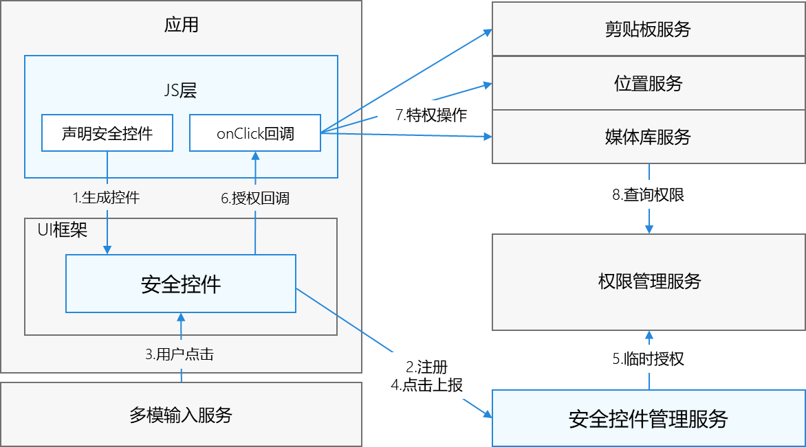

# 安全组件管理服务

## 简介

安全控件特性，提供了一组称为“安全组件”的ArkUI组件，类似Button(按钮)、Text(文本)提供给开发者集成到自己应用界面中。
当用户点击了这类组件后，应用将被授予对应的临时授权，而不需要额外申请权限即可访问用户隐私数据，达到减少授权弹窗对用户的干扰。

例如：应用开发者可以在应用中集成位置组件(LocationButton)，这样就不用申请精准定位权限，当用户点击该组件时，应用可以获得前台情况下的精准定位临时权限，继而调用位置服务接口获取位置信息。

安全控件特性原理图如下所示：


由安全组件UX实现、安全组件管理服务组成。UX实现集成在ArkUI框架中，负责提供组件的具体绘制; 安全组件管理服务负责安全组件的管理、合法性检查、临时权限的授予等。

安全组件管理服务主要提供如下功能：

- 提供应用安全组件的注册、临时授权、取消注册等Native接口实现。

- 负责安全组件的合法性检查，只有合法的安全组件才能授权成功。

- 提供媒体库服务查询临时授权的Native接口实现。

- 提供安全增强相关接口及适配层，供厂商定制安全增强功能使用。


## 目录

```
/base/security/security_component_manager
├── frameworks                  # 框架层，基础功能代码存放目录
│   ├── common                  # 框架公共代码存放目录
│   ├── enhance_adapter         # 能力增强适配代码存放目录
│   └── security_component      # 安全组件服务框架代码存放目录
├── interfaces                  # 接口层
│   └── inner_api               # 内部接口层
│       ├── enhance_kits        # 安全组件配置接口代码存放目录
│       └── security_component  # 安全组件服务接口层代码存放目录
└── services                    # 服务层
    └── security_component_service/sa
        └── sa_main             # 安全组件服务侧代码存放目录

```

## 使用
### 接口说明

| **接口申明** | **接口描述** |
| --- | --- |
| int32_t RegisterSecurityComponent(SecCompType type, const std::string& componentInfo, int32_t& scId); | 注册安全组件 |
| int32_t UpdateSecurityComponent(int32_t scId, const std::string& componentInfo); | 更新安全组件信息 |
| int32_t UnregisterSecurityComponent(int32_t scId); | 取消注册安全组件 |
| int32_t ReportSecurityComponentClickEvent(int32_t scId, const std::string& componentInfo, const SecCompClickEvent& touchInfo, sptr&lt;IRemoteObject&gt; callerToken); | 上报点击事件，申请临时授权 |
| int32_t SetEnhanceCfg(uint8_t* cfg, uint32_t cfgLen); | 设置安全组件增强的配置，供多模服务使用 |
| int32_t GetPointerEventEnhanceData(void* data, uint32_t dataLen, uint8_t* enhanceData, uint32_t& enHancedataLen); | 获取点击事件的安全增强数据，供多模服务使用 |
| bool ReduceAfterVerifySavePermission(AccessToken::AccessTokenID tokenId); | 校验后取消保存组件权限 |

## 相关仓

**[arkui\_ace\_engine](https://gitee.com/openharmony/arkui_ace_engine/blob/master/README_zh.md)**

**[multimodalinput\_input](https://gitee.com/openharmony/multimodalinput_input/blob/master/README_zh.md)**
